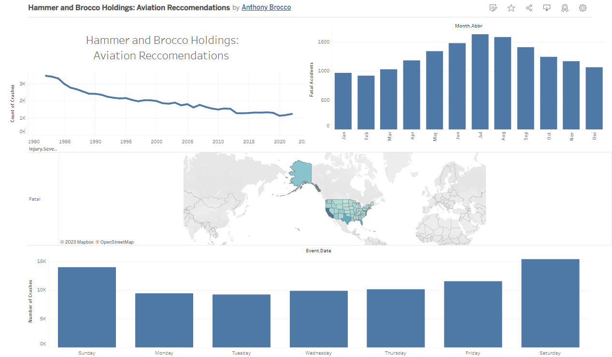

# Anthony and Michael's Aviation Ventures

## Overview

Anthony and Michael attended the Flatiron School Data Science bootcamp together in 2018. Both had a keen interest in business, so together they started a small betting company using statistics to bet on positive expected value markets. Recently, they hit it big, winning $500M in a Mega Million pot. They have decided to use this money to expand their business into aviation, which is Anthony's pet passion. They use a data-dependent approach to decide which projects to pursue and have started a commercial airplane leasing company.

## Business Understanding

As part of their aviation venture, Anthony and Michael are seeking to address key business questions from stakeholders, including:

- **Stakeholder 1:** What factors contribute to the safety and reliability of commercial airplanes?
- **Stakeholder 2:** How does the age of an airplane impact its performance and safety?
- **Stakeholder 3:** What are the seasonal trends in commercial aviation safety?

## Data Understanding and Analysis

### Source of Data

The dataset 'aviation_data.csv' has been used for the analysis. It contains comprehensive airplane crash statistics.

### Description of Data

The dataset includes information about various aspects of airplane crashes, such as location, date, aircraft characteristics, and injuries. It provides valuable insights into aviation safety and performance.

### Summary of Conclusions

The analysis of the aviation dataset yielded three relevant findings:

1. Commercial Planes Perform Better: The analysis indicates that commercial airplanes generally exhibit better safety and performance metrics compared to other types of aircraft.
2. Newer Planes are Safer: Newer airplanes tend to have better safety records and performance metrics compared to older planes. Investing in modern aircraft might contribute to improved outcomes.
3. Flying in Colder Months: Contrary to expectations, the analysis suggests that flying during colder months is associated with better safety records. Further investigation into the reasons behind this trend could be valuable.

These insights will play a crucial role in Anthony and Michael's decision-making process as they expand their business into the aviation industry.

For more detailed information, refer to the analysis in the 'aviation_analysis.ipynb' notebook linked in this repository.
