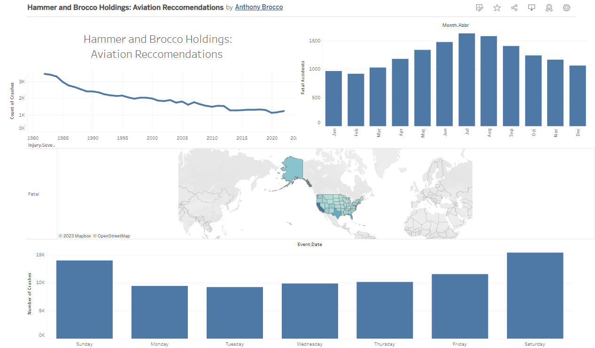

#Brocco Holdings' Aviation Ventures

## Overview

Anthony attended the Flatiron School Data Science bootcamp together in 2018. With a keen interest in business, they started a small betting company using statistics to bet on positive expected value markets. Recently, they hit it big, winning $500M in a Mega Million pot. They have decided to use this money to expand their business into aviation, which is Anthony's pet passion. They use a data-dependent approach to decide which projects to pursue and have started a commercial airplane leasing company.

As part of their aviation venture, Anthony is seeking to address key business questions from stakeholders, including:

- **Stakeholder 1:** What factors contribute to the safety and reliability of commercial airplanes?
- **Stakeholder 2:** How does the age of an airplane impact its performance and safety?
- **Stakeholder 3:** What are the seasonal trends in commercial aviation safety?

### Description of Data

The dataset includes information about various aspects of airplane crashes, such as location, date, aircraft characteristics, and injuries. It provides valuable insights into aviation safety and performance.

The shape of the dataset is 31 columns by 79899 rows

### Source of Data

The dataset 'aviation_data.csv' has been used for the analysis. It contains comprehensive airplane crash statistics.
The NTSB aviation accident database contains information from 1962 and later about civil aviation accidents and selected incidents within the United States, its territories and possessions, and in international waters.

https://www.kaggle.com/datasets/khsamaha/aviation-accident-database-synopses

## Data Understanding and Analysis

This graph includes visualazations such as crashes by year, crashes by month, crashes for different weather conditions as well as fatal crashes per state.

https://public.tableau.com/app/profile/anthony.brocco/viz/HammerandBroccoHoldingsAviationReccomendations/Dashboard1?publish=yes

### Summary of Conclusions

The analysis of the aviation dataset yielded three relevant findings:

1. Commercial Planes Perform Better: The analysis indicates that commercial airplanes generally exhibit better safety and performance metrics compared to other types of aircraft.
2. Newer Planes are Safer: Newer airplanes tend to have better safety records and performance metrics compared to older planes. Investing in modern aircraft might contribute to improved outcomes.
3. Flying in Colder Months: Contrary to expectations, the analysis suggests that flying during colder months is associated with better safety records. Further investigation into the reasons behind this trend could be valuable.

These insights will play a crucial role in Anthony and Michael's decision-making process as they expand their business into the aviation industry.

For more detailed information, refer to the analysis in the 'aviation_analysis.ipynb' notebook linked in this repository.

## Next Steps

As continues their journey into the aviation industry, there are several key next steps they plan to take:

#1. Deeper Analysis and Modeling

While the initial analysis has provided valuable insights, the duo intends to delve deeper into the dataset, and merging in more in depth models that give a broader range of data. Some examples include specificifying our fatalaties by state into a per capita metric. Concurrent data including prices of planes by make, model, age, and engine type.  This would involve exploring more complex relationships between variables and employing advanced machine learning techniques to build predictive models. By harnessing the power of data science, they aim to create models that can forecast potential safety concerns, aircraft performance, and even identify emerging trends.

#2. Collaboration with Industry Experts

Recognizing the complexity and depth of the aviation industry, Anthony intends to collaborate with industry experts, regulatory bodies, and aviation professionals. By leveraging their newfound resources and connections, they aim to gain a holistic understanding of the sector's challenges and opportunities. This collaborative approach will enable them to make informed decisions and align their ventures with industry best practices.

#3. Implementing Data-Driven Business Strategies

Anthony has always emphasized the importance of data-driven decision-making. They plan to apply this principle to every facet of their aviation ventures. By integrating data analytics into operations, maintenance, leasing strategies, and risk assessment, they hope to optimize their business processes and maximize returns on investments.

#4. Continuous Learning and Adaptation

The aviation industry is dynamic and ever-evolving. Anthony is committed to staying ahead of the curve by continuously learning about emerging technologies, regulatory changes, and industry advancements. They recognize that maintaining a growth mindset and adapting their strategies will be essential to long-term success.

#5. Sharing Insights with the Community

As advocates for the power of data science, Anthony plans to share their insights, findings, and best practices with the broader community. This may involve contributing to industry publications, presenting at conferences, and hosting workshops. By fostering knowledge exchange, they aim to contribute positively to the aviation industry's growth and innovation.

Anthony is excited about the future of their aviation ventures. With a strong foundation in data science and a passion for aviation, they are well-positioned to make meaningful contributions and thrive in this new venture.

For more information on their analyses and progress, keep an eye on this repository and follow their journey on social media.

---

